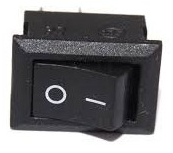
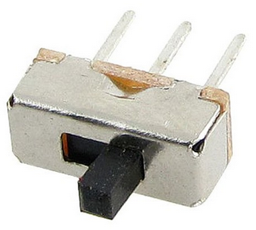
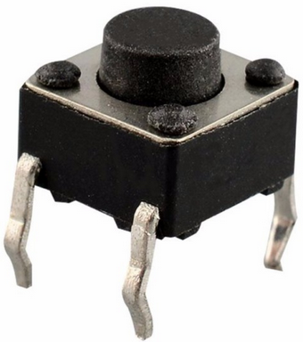
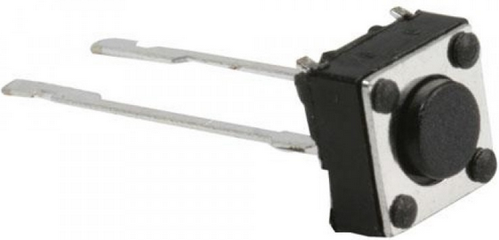
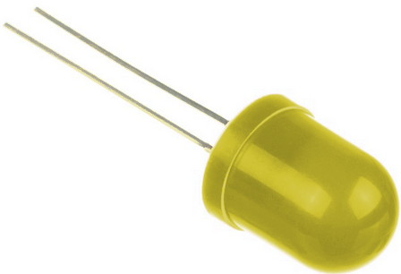
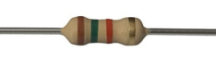
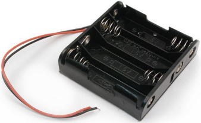
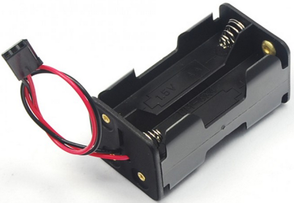

## Caparacho duro

El componente principal que permitirá la comunicación con todos sus periféricos será como un escudo (shield) artesanal, que puede llegar a construirse también con elementos de reciclaje, se dispondrán diseños y tutoriales del armado del Caparacho y sus periféricos.

Para armar la interfaz de conexión principal se necesitan pocos componentes, el diagrama se muestra a continuación:

Caparacho se puede construir artesanalmente con los siguientes:

* Conectores rj11 4p4c
  >   Estos conectores se pueden encontrar de reciclaje por conexiones telefónicas en casas, nuevos en tiendas de electrónica o comprados a través de internet.
* Interruptor para encendido
  >   Encontrar de reciclaje un interruptor es fácil, solamente que pueda tener conformaciones variadas, lo que se necesita es que se ocupe para encender y apagar el circuito.
* Botón de presión
  >   Como los interruptores es posible encontrarlo de reciclaje de aparatos viejos, su función es lograr la continuidad en el circuito de reset para cuando se quiere reiniciar el programa contenido en la placa controladora
* Pines para conexión con la placa controladora
  >  Los conectores es un poco mas complicado conseguirlos en reciclaje, pero son baratos en tiendas de electrónica y por compra de tiendas virtuales.
* LED indicador de encendido
  >  Un diodo emisor de luz de cualquier color servirá, se recomienda el de color amarillo para notarlo, pero podría ser de cualquier color, también es fácil de encontrar de reciclaje y en tiendas reales o virtuales de electrónica.
* Resistencia de 1.5k &#0911;
  >  Esta resistencia es para que el voltaje sugerido no queme el LED, si la fuente cambia la resistencia debería hacerlo también, para la fuente sugerida de 12 voltios de corriente directa se sugiere una resistencia de 1.5k ohmios, la cual se reconoce por sus bandas café, verde y rojo, esta resistencia es posible encontrarla de reciclaje, pero hay que ser observador para distinguir la de valor correcto pues es un componente muy común en todos los circuitos.
* Cables para unir los componentes
  >  Encontrar cables es algo mas común de reciclado, igual es barato conseguirlo nuevo, el cable del UTP para redes es comúnmente utilizado para montaje de circuitos en prototipos.
* Cajas para baterías como fuente de 12V
  >   Encontrarlas no es complicado, también podrían fabricarse artesanalmente, o comprarse, la idea es proveer una forma práctica de reunir 8 baterías AAA y que brinden un aproximado de 12 voltios de corriente directo.

Para poder unir los componentes se requieren herramientas como cautiín, estaño, pasta y tal vez estructuras sólidas, para ello se brindará una opción de como puede ensamblarse con cartón o madera delgada.