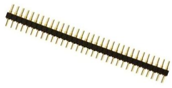

## Caparacho duro

El componente principal que permitirá la comunicación con todos sus periféricos será como un escudo (shield) artesanal, que puede llegar a construirse también con elementos de reciclaje, se dispondrán diseños y tutoriales del armado del Caparacho y sus periféricos.

Para armar la interfaz de conexión principal se necesitan pocos componentes, el diagrama se muestra a continuación:

Caparacho se puede construir artesanalmente con los siguientes:

* Conectores rj11 4p4c
  >   Estos conectores se pueden encontrar de reciclaje por conexiones telefónicas en casas, nuevos en tiendas de electrónica o comprados a través de internet.
* Pines para conexión con arduino
  >  Los conectores es un poco mas complicado conseguirlos en reciclaje, pero son baratos en tiendas de electrónica y por compra de tiendas virtuales.
* Cables para unir los componentes
  >  Encontrar cables es algo mas común de reciclado, igual es barato conseguirlo nuevo, el cable del UTP para redes es comúnmente utilizado para montaje de circuitos en prototipos.