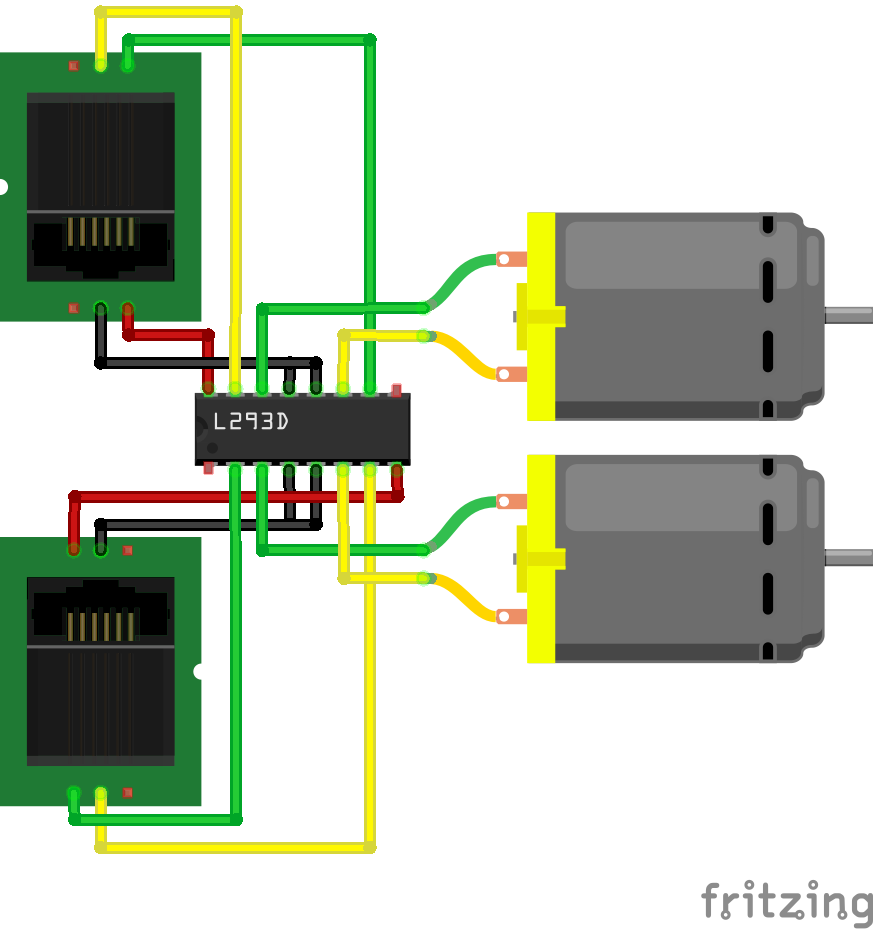

## Cuchumbitos

Los periféricos creados para Caparacho serán pequeños elementos conectables al escudo artesanal siguiendo los esquemas de cableado definido para el mismo, permitiendo que puedan ser ensamblados en contenedores de partes reciclaje preferiblemente.

### Controlador de dos motores

Para conectar dos motores de corriente directa.

Esquematico:[controlador_de_dos_motores_sin_enable](./controlador-de-dos-motores/controlador_de_dos_motores_sin_enable.fzz)

Código Arduino:[controlar_dos_motores_con_l293d_sin_enable](./controlador-de-dos-motores/controlar_dos_motores_con_l293d_sin_enable.ino)
